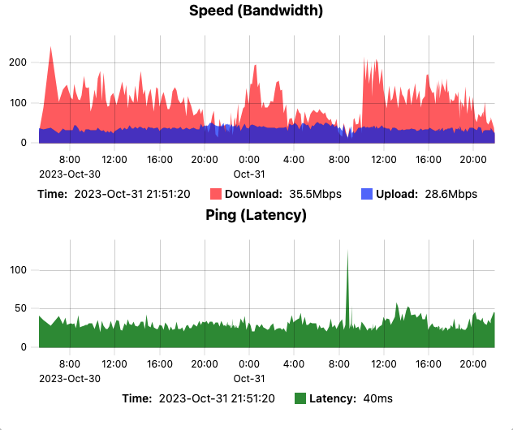

**SpeedKetchup**
------------------------------

Run periodic internet [speed test](https://speedtest.net), store, display results with builtin web server.

---
### Introduction

This aims to be small, efficient all-in-one program (statically linked, includes web assets) written in [rust](https://rust-lang.org).
- [linux x86_64 binary](bin/speedketchup) (750k)
- [linux arm binary](bin/speedketchup-arm) (650k)
- [windows x86_64 binary](bin/speedketchup.exe) (545k)
- [macos universal binary](bin/speedketchup-macos) (1090k)

---
### Builtin web server

---
### Features

- automatic speedtest server selection based on latency or run against specific speedtest server
- tiny list of rust dependencies: [std](https://doc.rust-lang.org/std/index.html), [libc](https://crates.io/crates/libc), [roxmltree](https://crates.io/crates/roxmltree) + [xmlparser](https://crates.io/crates/xmlparser)
- results are stored in human readable [.csv](https://en.wikipedia.org/wiki/Comma-separated_values), other storage backends incoming
- builtin web-server to display results with [uPlot](https://github.com/leeoniya/uPlot) chart
- all web assets are included in the program binary
- statically linked with [musl](https://musl.libc.org/) - not dependent on system [libc](https://en.wikipedia.org/wiki/C_standard_library), essentially a single binary container

---
### Alternatives

- https://github.com/barrycarey/Speedmon - a python implementation
